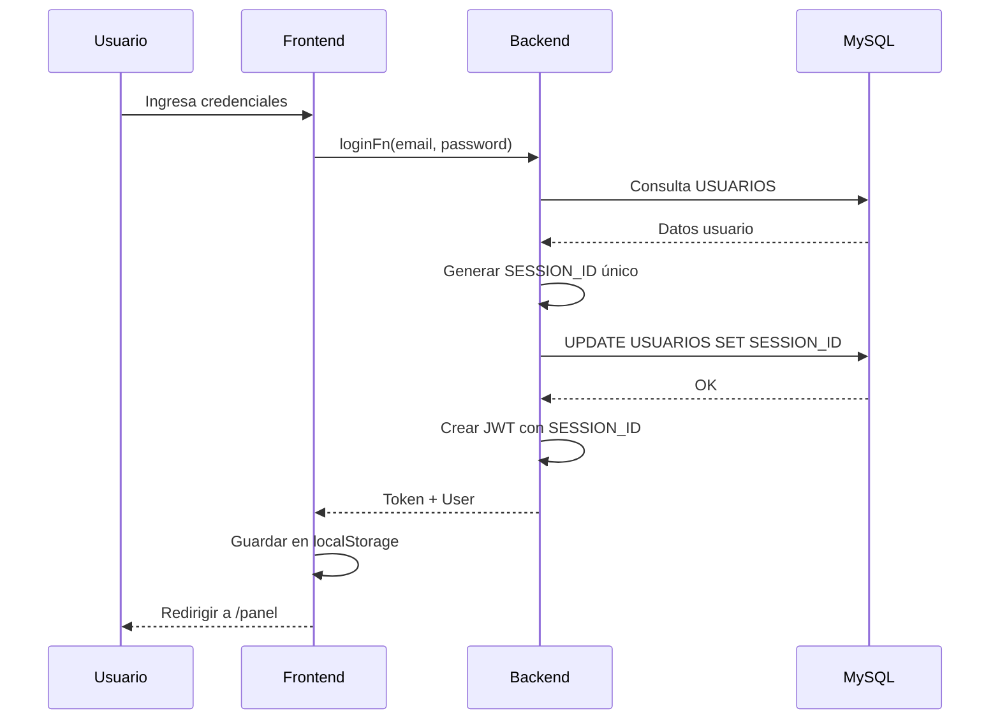
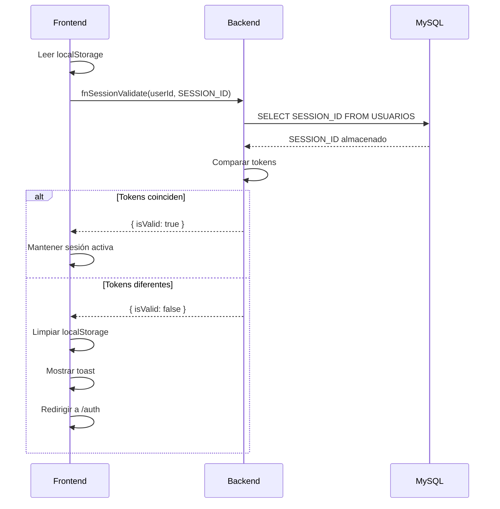
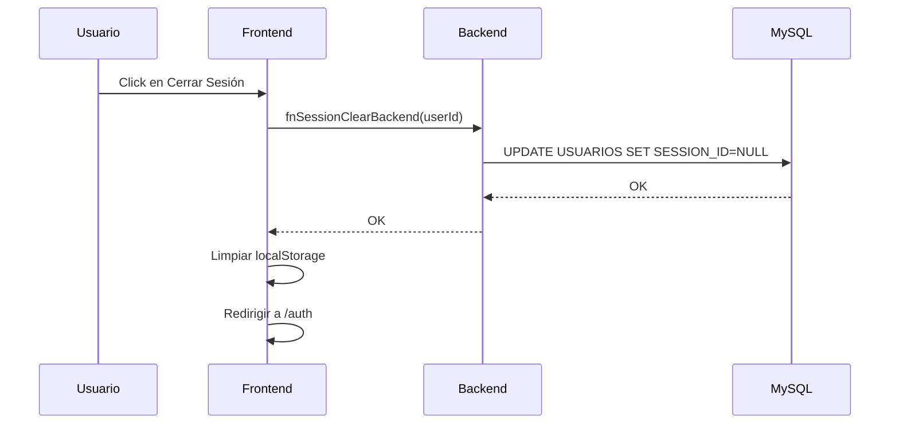

# Implementación de Sesión Única por Usuario

## 📋 Descripción

Esta funcionalidad evita que un mismo usuario pueda tener múltiples sesiones activas simultáneamente. Cuando un usuario se loguea, cualquier sesión anterior del mismo usuario es automáticamente invalidada.

## 🔧 Cambios Realizados

### 1. Base de Datos

**Archivo:** `database/migrations/add_session_id_to_usuarios.sql`

Se agregó la columna `SESSION_ID` a la tabla `USUARIOS`:
- Tipo: `VARCHAR(255) NULL UNIQUE`
- Propósito: Almacenar el token de sesión activo más reciente
- Índice: `idx_session_id` para búsquedas rápidas

**Ejecutar migración:**
```sql
source database/migrations/add_session_id_to_usuarios.sql
```

### 2. Backend - Archivos Modificados

#### `src/integrations/mysql/auth.ts`
- ✅ Agregado campo `SESSION_ID?: string` a interfaz `UsuarioRow`
- ✅ Importado módulo `crypto` para generación de tokens únicos
- ✅ Nueva función `generateSessionToken()`: Genera token único de 64 caracteres hex
- ✅ Nueva función `updateSessionToken(userId, token)`: Actualiza SESSION_ID en BD
- ✅ Nueva función `validateSessionToken(userId, token)`: Valida si el token coincide con BD
- ✅ Nueva función `clearSessionToken(userId)`: Limpia SESSION_ID (logout)
- ✅ Modificada función `login()`: Ahora genera y guarda SESSION_ID antes de crear JWT

#### `src/types/genericTypes.ts`
- ✅ Agregado `SESSION_ID?: string` a `SessionUser`
- ✅ Agregado `SESSION_ID?: string` a `JwtPayload`

#### `src/integrations/mysql/session.ts`
- ✅ Modificada función `clearSession()`: Ahora también limpia SESSION_ID en BD si se proporciona userId

### 3. Server Functions - Archivos Nuevos

#### `src/server-functions/fnSessionValidate.ts`
- Valida el SESSION_ID contra la base de datos
- Retorna `{ isValid: boolean }`

#### `src/server-functions/fnSessionClear.ts`
- Limpia el SESSION_ID en la base de datos
- Usado durante logout explícito

### 4. Frontend - Archivos Modificados

#### `src/hooks/use-session.tsx`
- ✅ Importadas funciones `fnSessionValidate` y `fnSessionClearBackend`
- ✅ Nueva función `logout(reason?)`: Centraliza lógica de cierre de sesión
- ✅ Modificado `useEffect` inicial: Valida SESSION_ID al cargar sesión desde localStorage
- ✅ Modificada función `refresh()`: Valida SESSION_ID antes de extender sesión
- ✅ Si SESSION_ID es inválido → muestra toast y cierra sesión automáticamente

## 🔄 Flujo de Funcionamiento

### Login Exitoso


### Validación de Sesión al Cargar


### Logout


## 🎯 Casos de Uso

### Caso 1: Usuario se loguea en Dispositivo A
1. Usuario ingresa credenciales en Computadora A
2. Sistema genera SESSION_ID = "abc123..."
3. SESSION_ID se guarda en BD y en JWT
4. Sesión activa exitosamente

### Caso 2: Mismo usuario se loguea en Dispositivo B
1. Usuario ingresa mismas credenciales en Computadora B
2. Sistema genera nuevo SESSION_ID = "xyz789..."
3. BD actualiza: SESSION_ID ahora es "xyz789..."
4. Sesión en Computadora A queda invalidada
5. Próxima petición desde A recibirá error de sesión

### Caso 3: Usuario con sesión invalidada intenta usar el sistema
1. Computadora A tiene SESSION_ID = "abc123..." (antiguo)
2. BD tiene SESSION_ID = "xyz789..." (nuevo)
3. Frontend valida SESSION_ID → retorna `false`
4. Sistema muestra: _"Tu sesión fue cerrada porque iniciaste sesión en otro dispositivo"_
5. Redirige a `/auth` automáticamente

## 📁 Archivos Modificados/Creados

| Archivo | Tipo | Descripción |
|---------|------|-------------|
| `database/migrations/add_session_id_to_usuarios.sql` | Nuevo | Script de migración BD |
| `src/integrations/mysql/auth.ts` | Modificado | Lógica de SESSION_ID |
| `src/types/genericTypes.ts` | Modificado | Tipos actualizados |
| `src/integrations/mysql/session.ts` | Modificado | Logout con limpieza BD |
| `src/server-functions/fnSessionValidate.ts` | Nuevo | Validación de sesión |
| `src/server-functions/fnSessionClear.ts` | Nuevo | Limpieza de sesión |
| `src/hooks/use-session.tsx` | Modificado | Validación en frontend |
| `docs/SESSION_UNICA.md` | Nuevo | Esta documentación |

## ⚠️ Consideraciones Importantes

1. **JWT Expiración**: El token JWT expira a las 10 horas por defecto
2. **Refresh Automático**: La sesión se refresca 30 segundos antes de expirar
3. **Validación Periódica**: SESSION_ID se valida en:
   - Carga inicial de la aplicación
   - Cada refresh de sesión
   - Cualquier petición que use `useSession()`

4. **Mensajes al Usuario**:
   - "Sesión expirada" → Token JWT vencido
   - "Tu sesión fue cerrada porque iniciaste sesión en otro dispositivo" → SESSION_ID invalidado

## 🧪 Pruebas Recomendadas

1. **Login múltiple**: Loguearse en 2 navegadores diferentes con mismas credenciales
2. **Logout explícito**: Cerrar sesión y verificar que SESSION_ID sea NULL en BD
3. **Expiración**: Esperar 10 horas y verificar que token expire correctamente
4. **Refresh**: Verificar que sesión se mantenga activa con uso continuo

## 🐛 Troubleshooting

### Error: "SESSION_ID no encontrado en BD"
- Ejecutar migración SQL para agregar columna

### Error: "fnSessionValidate no está definido"
- Verificar imports en `use-session.tsx`
- Reiniciar servidor de desarrollo

### Sesión no se invalida en segundo dispositivo
- Verificar que `SESSION_ID` esté en el payload del JWT
- Revisar logs de consola en ambos dispositivos

## 📝 Notas Adicionales

- La funcionalidad es transparente para el usuario final
- No requiere cambios en componentes UI existentes
- Compatible con todos los permisos y roles actuales
- El campo `SESSION_ID` es `NULL` cuando el usuario no tiene sesión activa
